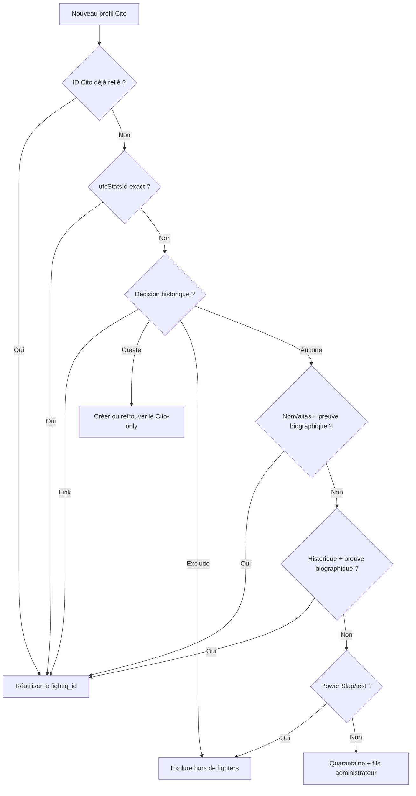

# FightIQ — architecture des données

> État consolidé au 17 août 2026.

## 1. Règle canonique

Un combattant réel correspond à un seul `fightiq_id`. Les identifiants externes
ne remplacent jamais cet ID : ils sont reliés autour de lui dans
`fighter_source_ids`.

État final autorisé dans `fighters` :

1. UFCStats + Cito associés ;
2. UFCStats seul ;
3. Cito seul avec preuve MMA suffisante.

Une entrée Power Slap, test, non-MMA ou sans preuve suffisante n'entre pas dans
`fighters`. Une identité seulement ambiguë est placée en quarantaine.

## 2. Données générales des combattants

### Identité

- `id` : identifiant technique Supabase ;
- `fightiq_id` : identifiant FightIQ stable ;
- `first_name`, `last_name`, `display_name`, `nickname` ;
- `date_of_birth`.

### Identifiants et liens externes

- `ufcstats_id`, `ufc_profile_url` ;
- `cito_id`, `cito_slug`, `cito_profile_url` ;
- `slug` FightIQ/courant.

### Mensurations

- `height_cm` ;
- `current_weight_kg` ;
- `reach_cm` ;
- `leg_reach_cm` ;
- `stance`.

Les unités enregistrées restent métriques. Les conversions impériales relèvent
uniquement de l'affichage.

### Situation et biographie

- `is_active`, `cito_status` ;
- `current_division` ;
- `place_of_birth` ;
- `trains_at` ;
- `fighting_style` ;
- `octagon_debut`.

### Images et provenance

- `photo_url`, `body_image_url` ;
- `photo_source` ;
- `photo_original_source` ;
- `photo_rights_status`.

### Record global Cito

- `cito_record_wins` ;
- `cito_record_losses` ;
- `cito_record_draws` ;
- `cito_record_nc`.

### Statistiques globales de striking

- frappes significatives réussies et tentées ;
- précision ;
- frappes significatives réussies par minute ;
- frappes significatives absorbées par minute ;
- défense de frappes significatives ;
- répartition tête, corps et jambes ;
- répartition debout, clinch et sol.

Champs correspondants :

```text
cito_sig_strikes_landed
cito_sig_strikes_attempted
cito_striking_accuracy
cito_sig_strikes_landed_per_min
cito_sig_strikes_absorbed_per_min
cito_sig_strike_defense
cito_strikes_head_pct
cito_strikes_body_pct
cito_strikes_leg_pct
cito_strikes_standing_pct
cito_strikes_clinch_pct
cito_strikes_ground_pct
```

### Statistiques globales de grappling et de combat

```text
cito_takedowns_landed
cito_takedowns_attempted
cito_takedown_accuracy
cito_takedown_defense
cito_takedown_avg_per_15
cito_submission_avg_per_15
cito_knockdown_avg
cito_average_fight_time_seconds
```

### Méthodes de victoire

```text
cito_wins_ko_tko
cito_wins_submission
cito_wins_decision
cito_wins_ko_tko_pct
cito_wins_submission_pct
cito_wins_decision_pct
```

### Ranking actuel

Ces champs sont stockés dans `fighters`, mais gérés par le pipeline ranking
séparé :

```text
ufc_rank
p4p_rank
champion_status
interim_champion
```

Ils représentent uniquement l'état actuel. L'historique des rankings et des
titres devra utiliser des tables de snapshots séparées.

### Fraîcheur et synchronisation

```text
cito_stats_source
cito_stats_freshness
cito_stats_synced_at
source_updated_at
cito_synced_at
fightiq_updated_at
```

## 3. Table `fighter_source_ids`

Cette table accepte plusieurs identités externes autour du même combattant :

| Champ | Rôle |
|---|---|
| `fightiq_id` | combattant canonique |
| `source` | `ufcstats`, `cito`, puis autres sources futures |
| `source_id` | identifiant dans la source |
| `source_name` | nom/alias utilisé par cette source |
| `is_primary` | identité principale pour cette source |
| `updated_at` | dernière modification du lien |

La contrainte logique est l'unicité de `(source, source_id)`.

## 4. Alias Cito principal et secondaire

Cito peut posséder plusieurs profils pour une même personne, par exemple une
variante orthographique, une translittération ou un nom localisé.

```text
fighters.cito_id
    └── profil Cito principal : peut enrichir fighters

fighter_source_ids
    ├── même profil principal, is_primary = true
    └── alias Cito secondaires, is_primary = false
```

Un alias secondaire reste recherchable et relié au combattant, mais ne peut pas
écraser le slug, la photo, la division, le record ou les statistiques du profil
principal.

## 5. Registre de résolution et quarantaine

La table historique `cito_unmatched_fighters` est désormais utilisée comme
registre de résolution. Son nom est ancien ; une ligne qu'elle contient n'est
pas nécessairement « unmatched ».

Statuts autorisés :

| Statut | Signification |
|---|---|
| `linked_existing_fighter` | profil relié à un combattant existant |
| `created_new_fighter` | combattant Cito-only créé après preuve MMA |
| `excluded` | Power Slap/test/non-MMA ou exclusion vérifiée |
| `quarantined` | identité douteuse conservée hors de `fighters` |

La quarantaine conserve :

- le profil Cito brut ;
- la raison ;
- les candidats FightIQ possibles ;
- la décision attendue `link | create | exclude` ;
- l'empreinte du profil ;
- l'empreinte de l'index canonique utilisé pour le matching ;
- le résumé de la récupération d'historique Cito ;
- les preuves combat par combat présentées à l'administrateur.
- pour chaque candidat, les valeurs biographiques comparées, la relation entre
  les lieux de naissance et les mensurations concordantes ou contradictoires.

Une quarantaine n'est réévaluée automatiquement que si le profil Cito ou
l'index des identités/historiques FightIQ/UFCStats a changé. La future
application écrit ses décisions dans les colonnes de revue de cette table.
`data/fighter_identity_registry.json` est le secours versionné unique. Il
consolide le registre V5.6 et les corrections ultérieures avec une seule
décision finale par ID Cito.

Champs de revue ajoutés par la migration :

```text
review_status
review_classification
admin_action
target_fightiq_id
target_ufcstats_id
manual_profile
admin_notes
reviewed_by
reviewed_at
action_applied_at
```

La vue `admin_fighter_identity_queue` expose seulement la file utile à
l'administration. Une décision approuvée est validée puis appliquée par le
synchroniseur ; le navigateur ne modifie jamais directement `fighters`.

## 6. Preuve par historique de combats

Pour un nouveau profil sans ID direct, le script charge à la demande :

- l'historique Cito `/ufc/fighters/{slug}/fights` ;
- les résultats UFCStats, les adversaires, les événements, les dates et les IDs
  de combats disponibles dans les snapshots publics.

Ordre des comparaisons :

1. même ID de combat ;
2. même adversaire et même événement ;
3. même adversaire et même date ;
4. compatibilité des résultats sur les combats reconnus ;
5. palmarès global uniquement comme corroboration secondaire.

Les variantes de nom, noms inversés, surnoms, accents, translittérations et
anciens `source_name` servent à découvrir les candidats. Ils ne suffisent pas à
valider l'identité.

Un nom différent peut être traité comme alias seulement lorsque :

1. au moins deux combats et leurs résultats sont compatibles ;
2. l'historique est suffisamment fort : deux IDs de combats directs, trois
   combats reconnus, ou deux combats corroborés par une date ou un lieu de
   naissance précis ;
3. au moins une preuve biographique indépendante concorde : date de naissance
   complète exacte, lieu de naissance précis compatible, ou deux mensurations
   compatibles parmi taille, allonge et poids courant.

Si les mensurations constituent la seule preuve biographique, l'historique doit
contenir au moins trois combats reconnus ou deux IDs directs. Un pays identique
seul reste un indice trop large. Un palmarès identique, un nom, un surnom ou un
slug sans autre preuve ne suffit jamais.

Contradictions fortes :

- même ID de combat avec un autre adversaire ;
- même événement/date avec un autre adversaire ;
- résultat opposé pour le même combat ;
- deux dates de naissance complètes différentes ;
- au moins deux incohérences physiques importantes entre taille et allonge.

Les CSV UFCStats identifient les participants par nom dans les résultats. Si
deux IDs UFCStats partagent exactement le même nom, le script refuse d'attribuer
l'historique par supposition et laisse la décision à l'administrateur.

## 7. Ordre de résolution d'un profil Cito



Le nom seul ne valide jamais une fusion. Un identifiant externe exact ou une
décision V5.6 validée reste prioritaire. Hors de ces cas, une date de naissance
exacte, un lieu précis ou plusieurs mensurations doivent corroborer le nom et/ou
l'historique. Un slug seul ou plusieurs combats seuls ne sont plus décisifs.

## 8. Signification d'une décision `create`

`create` ne signifie pas « créer dès que le nom n'existe pas ». Cela signifie
qu'une vérification précédente a établi :

- qu'il s'agit bien d'un combattant MMA ;
- qu'au moins un combat ou profil UFC/MMA est documenté ;
- qu'aucun combattant UFCStats/FightIQ existant ne correspond de manière sûre.

Le synchroniseur recherche d'abord le `fightiq_id` déterministe, le `cito_id` et
une ancienne résolution. Il réutilise la fiche retrouvée par ces identifiants.
Une simple collision de nom bloque la création sans fusion automatique.

## 9. Comportement en cas d'échec

| Échec | Comportement |
|---|---|
| UFCStats ou Cito indisponible | aucune écriture |
| Connexion/lecture Supabase impossible | aucune écriture |
| Profil ambigu | quarantaine ; les autres mises à jour continuent |
| Historique Cito individuel indisponible | autres preuves utilisées ; quarantaine si elles restent insuffisantes |
| Historique adversaire/résultat contradictoire | aucune fusion ; cas envoyé à l'administration |
| Conflit entre IDs canoniques | run interrompu avant écriture |
| Validation canonique incorrecte | aucune écriture |
| Échec pendant les écritures | aucune suppression globale ; les écritures déjà passées restent et le run suivant converge |
| Ranking indisponible ou trop petit | anciens rankings conservés |
| Nom ranking non résolu | mises à jour sûres appliquées, nettoyage des anciens rangs reporté |
| Couverture ranking inférieure à 75 % de l'état précédent | anciens rangs non résolus conservés |

Le pipeline combattants ne supprime pas une fiche parce qu'elle manque
temporairement dans une source.

## 10. Domaines volontairement séparés

| Domaine | État actuel | Règle future |
|---|---|---|
| Combattants généraux | présent | pipeline canonique actuel |
| Rankings actuels | présent | script/workflow séparé |
| Événements et cartes | non développé | événements passés/futurs et composition des cartes |
| Combats et rounds | non développé | année → événement → combat → round |
| Historique rankings/titres | non développé | snapshots datés séparés |
| Presse et articles | non développé | liens par combattant, combat, événement et période |
| Utilisateurs/pronostics | non développé | profils, matchmaking et vainqueurs choisis |

Les événements, combats, rounds, articles et prédictions devront toujours
référencer le `fightiq_id` canonique.

## 11. Fusion d'une ancienne identité dupliquée

Une décision vérifiée peut révéler qu'une fiche Cito-only déjà créée correspond
à une identité UFCStats existante. Dans ce cas :

1. le registre prioritaire désigne explicitement l'ID UFCStats cible ;
2. le synchroniseur vérifie que la fiche à retirer ne possède aucune identité
   UFCStats ;
3. les alias `fighter_source_ids` et les résolutions Cito sont déplacés vers
   le `fightiq_id` canonique ;
4. les champs absents de la fiche canonique sont préservés depuis la fiche
   Cito-only ;
5. la fonction Supabase `merge_fighter_identities` exécute le lot dans une
   transaction unique ;
6. l'ancien identifiant est supprimé seulement après le transfert et les
   contrôles ; aucune redirection permanente n'est conservée.

La fonction réaffecte aussi les clés étrangères simples des futures tables qui
référencent `fighters.fightiq_id`. Une collision ou la présence de deux
identités UFCStats annule entièrement le lot.
